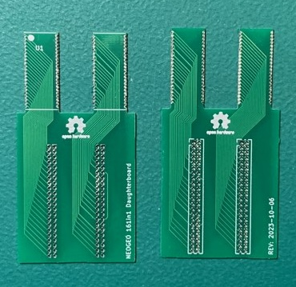
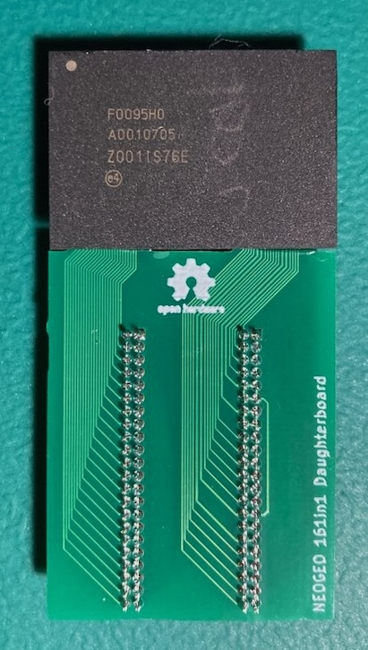
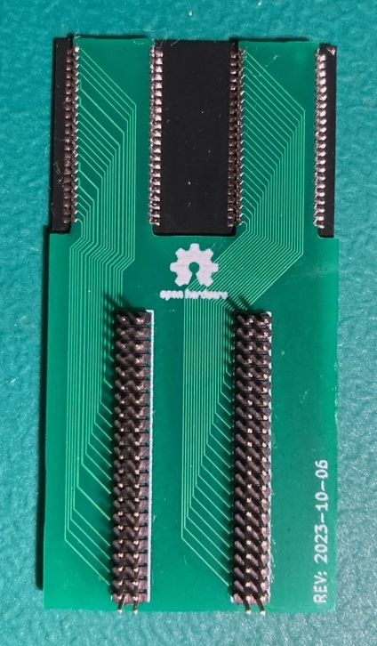
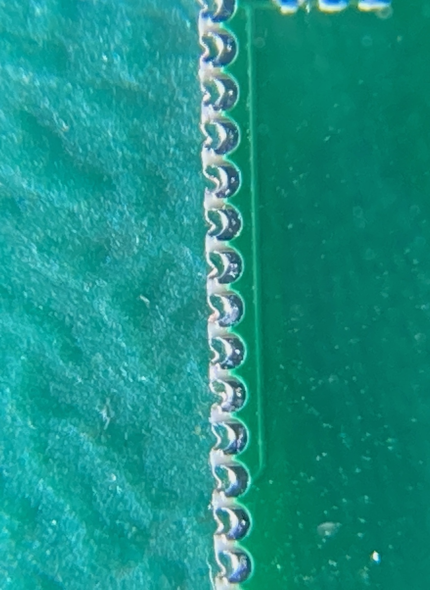
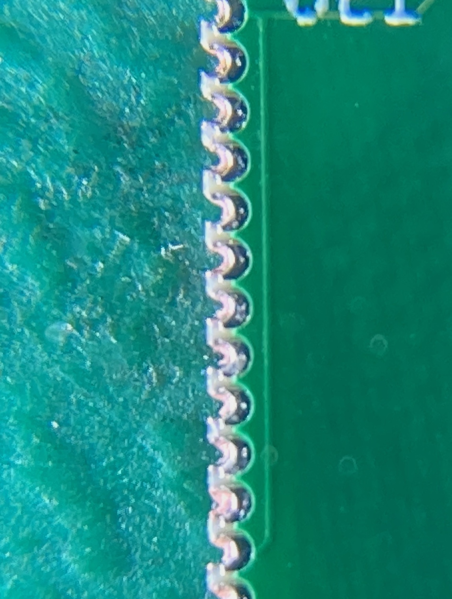

# neogeo-161in1-daughterboard

## Overview
Vortex's [VTXCart](https://github.com/xvortex/VTXCart/tree/main) project allows rewriting the flash/CPLD chips on the 161in1 V3 cart to contain whatever neogeo games you want.  Part of this process involves removing small daughterboards that contain the C/V roms.  These daughterboards are very thin and use a surface mounted 1.27 DIP connector.  It only takes a small amount of pull force on the board to cause the 1.27mm DIP pads to be pulled off the board.

This neogeo-161in1-daughterboard project is a replacement daughterboard that uses a through hole version of the 1.27mm DIP connector.

**Bare Boards:** 

**Assembled Top/Bottom:** 

## Manufacturing
You should select board thickness of 0.8mm.

The board has very fine pitched (0.8mm) castellated holes on it.  Ideally you would want to pick the castellated holes option with the PCB manufacture so they get cut cleanly.  However the PCB manufacturer will likely reject the order if you pick the option because most require 0.6mm hole diameter and 0.6mm distance between castellated holes.

Placing the order without the castellated holes option should go through but will cause the holes to be slightly mangled and look something like this.

You can see how the copper from the left side of the through hole is still there just kinda push flat against the cut path.  To fix this you can use fine tipped tweezers to push that extra copper into the right side of the hole.  It should end up looking something like this, which is good enough.

Don't attempt to pull the extra copper off or you could rip out all of the copper from the through hole.

Once done, I would suggest using a magnifying glass to verify you see raw pcb between each of the castellated holes.

## Parts
The F0095H0 flash chip comes from your damaged daughterboard.

The dip male connectors are dual row 1.27mm, 22 pins per row, 44 pins total per connector.  Best bet is to just by some cheap 2x50 pin connectors and cut them down to size.

## Soldering
I'm going to assume you don't really need soldering advice if you are taking on the task of making a VTXCart.  But I will warn you to be careful when soldering the dip connector.  It doesn't seem to take much heat and side pressure to cause the individual pins to shift around and you can end up with pins pointing all over the place instead of 2 straight lines.

## Install
TODO